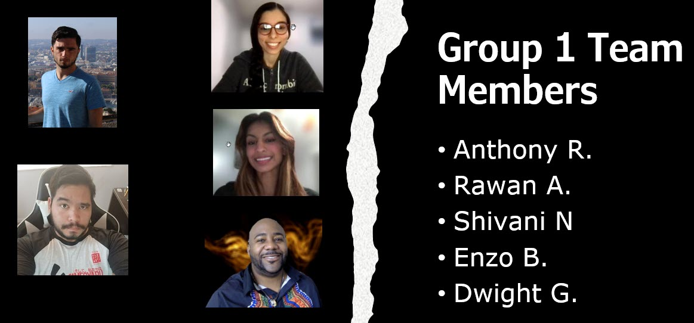
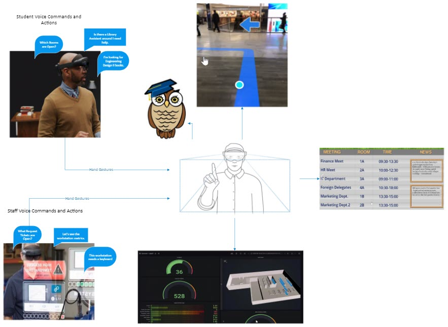

# FAU Library AR for digital twin (The LibAR) Software

Shanisse
## Sponsor
**Mahesh Neelanka** FAU Library

## Advisor
**Hari Kalva** Professor and Associate Chair EECS FAU

### Abstract
The LibAR is a software, hardware solution for providing Students and FAU Library  staff  different  experiences  for  utilizing  the  FAU  Library  services  through  an AugmentedReality  (AR)  device:  the  Microsoft  HoloLens  2and  AWS  and  Azure  cloud services.

### Keywords
FAU, library, augmented reality, IoT, digital twin, LibAR 

### Team Members
| Name | Role | Contact |
| ------- | --------- | ---------- |
| DwightGoins | Team Lead/ Software Engineer | Dgoins2019@fau.edu |
| Rawan Alhindi | Software Engineer | Ralhindi2019@fau.edu |
| Enzo Bossa | Software Engineer| Ebossa2018@fau.edu |
| Anthony Robustelli | Software Engineer | Arobustelli2018@fau.edu |
| Shivani Nanan | Software Engineer | Snanan2018@fau.edu |

Main Use Case Mockup:

### Description
LibAR, AR system we are developing, will use AWS IoT Twin Maker and Microsoft HoloLens 2 to generate useful, at a glance, information that can be viewed and interacted with within an AR environment. When the user puts on the headset, they will be asked to choose a corresponding role between staff or student. Depending on the role that the user chooses, they will be given a different experience.  

If the user chooses the student role, they will be able to look up a book or look for available study rooms. The student will make selections using the HoloLens built in speech, gesture and eye tracking controls and will be greeted with an Owsley, the FAU Owl virtual assistant. If the student wants to get information on a particular book, they will do a search for the book through voice command which will do an API query to the library’s book tracking and database. The UI/UX will show if the book has been checked out or not and where the user can find the book. The student can then choose to be guided to the book location at which time Owsley will guide the student through AR pathfinding using a combination of the HoloLens tracking within the Digital Twin library environment and other location markers like beacons or QR code stickers withing the physical library to guide the student to the shelf where the book is located. Within the same idea, when the student chooses to reserve a study room, the HoloLens 2 device will query the LibCal system to see if there are study rooms available or what times they are available. The student can then choose to book one of the rooms which will send the request to the LibCal system to reserve the room. This subsystem can also utilize the pathfinding features to guide the student to the room. 

If the user chooses the staff role, they will be greeted with an interface that shows them the IT information for tickets that are attached to the library. This role will query an API to the IT ticketing system and return listed tickets for anything involved with the library. The user can select a ticket to track it and use the pathfinding system to be guided to where the affected computer is located. Along with ticket tracking, the user can also “scan” a computer by focusing on a QR code sticker attached to the computer which will query a health agent installed in the computer. The agent will allow the user to see computer health information about the chosen computer through an AR overlay and from within this overlay, the user can choose to submit a ticket for the computer if they see that there is something wrong. Finally, a user can use the HoloLens to look at a computer area to see if there are any tickets associated with that area and see what computers have tickets open for them and how long the ticket has been open through AR informational overlays. 

### Software
This project consists of Unity 2020.3.xx project built for the Microsoft HoloLens 2 device.
 
It can be adopted to work with a Magic Leap 2 device, HoloLens 1 and Magic Leap 1 device.